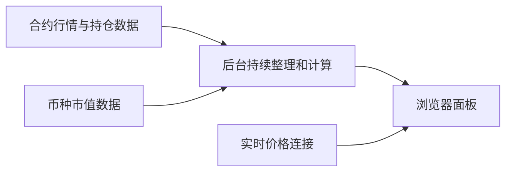

# Realtime OI Dashboard

一个用于查看 **Binance USDT 永续合约** 行情、持仓量（OI）变化和市场信号的网页面板。

> 页面只展示市场数据，不构成投资建议。

## 可以看到什么

- **7D OI 异动信号**：快速查看近 7 天持仓量变化明显的币种。
- **OI 变化排行**：按持仓价值、市值、成交额及价格或持仓变化筛选和排序。
- **持仓 / 市值**：比较合约持仓价值与币种市值的比例；无法匹配市值时显示 `-`。
- **信号扫描**：展示多头趋势、空头趋势和波动率突然升高的币种。
- **收藏与搜索**：收藏保存在当前浏览器中，也可以按币种名称搜索。
- **实时价格**：页面打开时持续接收最新合约价格。

## 安装

需要 Python 3.10 或更高版本。

在项目目录中运行：

```bash
python3 -m venv .venv
.venv/bin/python -m pip install -r requirements.txt
```

## 启动

```bash
.venv/bin/python main.py
```

看到启动提示后，在浏览器打开：

```text
http://127.0.0.1:8777
```

按 `Control + C` 可以停止程序。

### 用手机访问本地面板

手机和电脑连接同一个网络，然后这样启动：

```bash
.venv/bin/python main.py --host 0.0.0.0 --port 8777
```

再用手机浏览器打开电脑的局域网地址，例如：

```text
http://192.168.1.6:8777
```

其中 `192.168.1.6` 需要替换成电脑当前的局域网 IP。

## 数据如何更新



- OI、历史变化、成交额、资金费率和信号扫描由后台定时更新。
- 实时价格在浏览器打开页面后持续更新。
- 市值数据单独缓存和定时刷新，不会阻塞 OI 更新。
- 某个币种暂时取不到数据时，会保留其他币种的正常结果。

## 常见问题

### 页面能打开，但没有数据

先查看运行窗口是否出现网络错误。数据来源暂时不可用、当前网络无法连接，或请求频率受到限制时，页面可能需要等待下一轮更新。

### 市值显示 `-`

部分新币、特殊合约或代码名称无法和市值数据匹配。这不会影响价格、OI 和成交额的显示。

### 收藏为什么换设备后不见了

收藏保存在浏览器本地，不会自动同步到其他浏览器或设备。清除网站数据也会删除收藏。

### 手机无法访问电脑上的面板

确认手机和电脑在同一个网络、程序使用 `--host 0.0.0.0` 启动，并检查电脑是否允许端口 `8777` 的局域网连接。

## 可选设置

正常使用不需要修改。网络不稳定或请求过快时，可以降低更新速度：

```bash
.venv/bin/python main.py \
  --oi-batch-size 10 \
  --oi-batch-delay 2 \
  --oi-workers 1
```

查看全部启动选项：

```bash
.venv/bin/python main.py --help
```

## 数据来源

- Binance Futures：合约价格、OI、成交额、资金费率和历史行情。
- CoinGecko：币种市值和完全稀释估值（FDV）。
- TradingView：图表页面。

## 测试

运行后端测试：

```bash
.venv/bin/python -m unittest discover -s tests -v
```

检查前端文件：

```bash
node realtime_oi_dashboard/scripts/check-static-js.mjs
```
